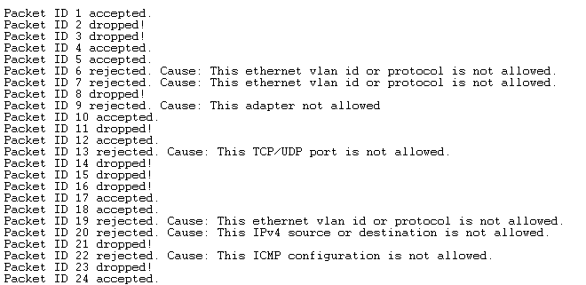

 # Firewall Simulator

This is a simulation of a network firewall developed using Prolog. The firewall clauses in database.pl are inspired from [this page](https://www.ibm.com/support/knowledgecenter/en/SSB2MG_4.6.2/com.ibm.ips.doc/concepts/firewall_rules_language.htm)

## Files
- The file engine.pl is the file which should be executed. This is the file which contains the driver code.
- The file database.pl is the file which contains all the predicates which define the database rules for the Firewall. This is where modifications, if any, should be made to configure the Firewall behaviour for different packet clauses.
- The file input.pl is the file in which sample packets have been defined. 
- The file ipv4_helper.pl contains procedures which help to parse the ip addresses, along with other general helper procedures.

A detailed description for each file can be found in the [wiki](../../wiki/Home) for each file.

### Input format

Sample inputs have been given in the input.pl file. For example:
- `packet(2,  ['D', 890, atalk,'172.17.2.19', '45.23.12.45',	 1, 	udp, 	90,		69,	 3, 9]).`
- `packet(3,  ['F', 700, ipx, 	'172.17.2.19', '172.17.2.13',	 34, 	tcp,	90,		80]).`

A detailed description can be found in the [documentation](../../wiki/Input) for inputs. 

### Driver procedure

The procedure `decide/2` should be queried to check the behaviour of the firewall for a specific packet, to determine whether a packet is accepted, rejected (in which case a message is given stating the cause for the rejection) or dropped silently. Its arguments (in order) are:
1. The packet ID (as described above).
2. The list defining the actual packet (as described above).

Example: `decide(2, ['D', 890, atalk,'172.17.2.19', '45.23.12.45',	 1, 	udp, 	90,		69,	 3, 9]).`

Further, this driver queries three other procedures to determine the conditions:
- `check_reject/2`: This procedure evaluates to true if there is any parameter of the packet which is specified to be rejected.
- `check_drop/2`: This procedure evaluates to true if there is any parameter of the packet which is specified to be dropped.
- `check_accept/2`: This procedure evaluated to true if there is any parameter of the packet which is specified to be accepted.
The evaluation proceeds in the above order, where the decision is based on the first procedure which evaluates to true. Rejection is given the highest preference, followed by drop and finally accept. In case none of these procedures evaluate to true, the default behaviour of the firewall is to silently drop the packet.

Complete information about each procedure and other related information can be found in the [documentation](../../wiki/Engine) for the engine.

### Firewall behaviour
If any reject rule matches with the packet header, then the packet is rejected. Same is the case with drop - if any drop rule matches with the packet header, the packet is dropped. This is to ensure that any unwanted packets dont reach the network. If anyone of the accept rule matches with the packet header, the packet is accepted. If none of the rules matches, it is dropped. Accept rules therefore allow us to "whitelist" specific packets, that is, to ensure that they reach the network if they dont match the reject or the drop rule. 

The code is currently configured to test the behaviour for all packets which are defined in the `packet/2` procedure within the input.pl file.

### Sample Output

The output displays whether a packet was accepted, rejected, or dropped. In case the packet is rejected, the cause for rejection is also displayed.